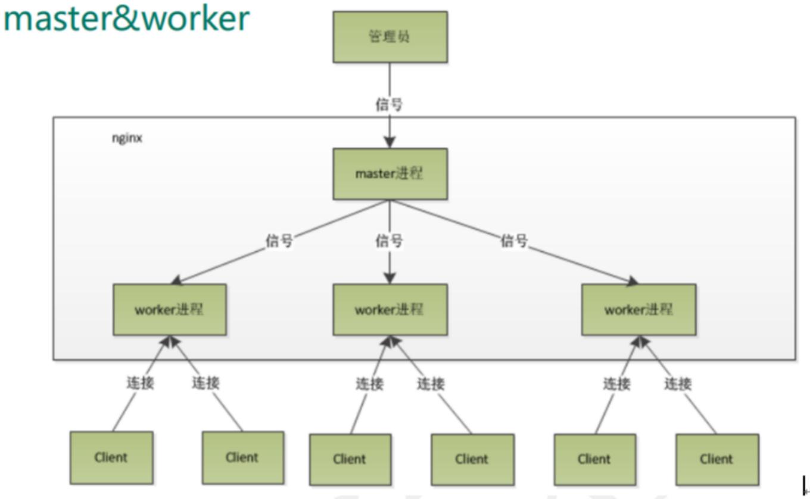
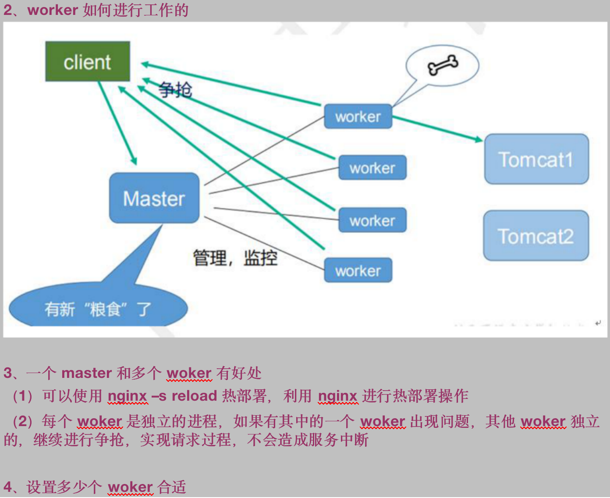
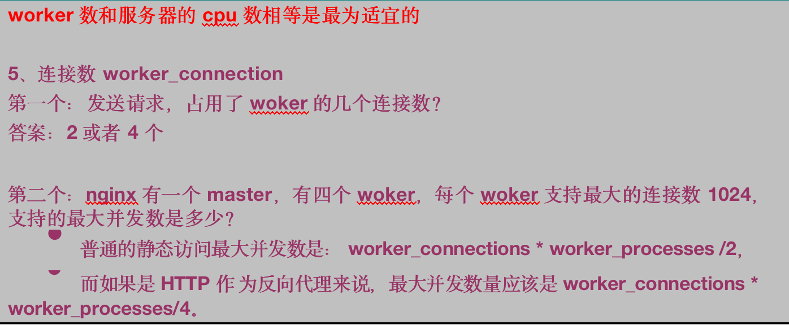

### 1 反向代理与正向代理

> 正向代理：通过代理服务器访问网络。
>
> 反向代理：通过反向代理服务器，把请求转发到目标服务器，然后返回数据。暴露的是代理服务器的ip,隐藏了真实服务器ip。

### 2 负载均衡

### 3 动静分离 

### 4 安装

docker 常用命令

```shell
docker stop $(docker ps -aq)   // 停止索引容器
docker rm $(docker ps -aq)     // 删除所有容器
```

docker-compose.yml:

```yaml
version: "3.7"
services:
  web:
    image: nginx:1.12.2
    container_name: nginx1.12
    volumes:
     - /docker-soft/ngnix/conf/nginx.conf:/etc/nginx/nginx.conf:ro
     - /docker-soft/ngnix/logs/nginx:/var/log/nginx
    restart: always
    ports:
     - "80:80"
     - "9001:9001"
    environment:
     - NGINX_HOST=foobar.com
    networks:
        nginx-network:
          ipv4_address: 172.19.0.2   

  tomcat1:
    image: tomcat:8.5
    container_name: tomcat8.5_1
    restart: always
    ports:
       - "8080:8080"
    volumes:
      - /docker-soft/ngnix/tomcat/apps8080:/usr/local/tomcat/webapps
      - /docker-soft/ngnix/tomcat/tomcat_conf/t_1:/usr/local/tomcat/conf
    networks:
        nginx-network:
          ipv4_address: 172.19.0.5   

  tomcat2:
    image: tomcat:8.5
    container_name: tomcat8.5_2
    restart: always
    ports:
      - "8081:8080"
    volumes:
      - /docker-soft/ngnix/tomcat/apps8081:/usr/local/tomcat/webapps  
      - /docker-soft/ngnix/tomcat/tomcat_conf/t_2:/usr/local/tomcat/conf
    networks:
        nginx-network:
          ipv4_address: 172.19.0.6     

networks:
   nginx-network:
      ipam:
         config:
           - subnet: 172.19.0.0/16   
    
   
```

### 5 常用命令

1 查看版本

```shell
ngnix -v
```

2 关闭

```shell
ngnix -s stop
```

3 启动

```shell
./nginx 
```

4 重新加载

```shell
ngnix -s reload
```

### 6配置文件

一共分3块

- 全局块

  > ngnix 服务整体运行的配置
  >
  > 如 worker_processes

- events

  > ngnix 与用户连接的配置
  >
  > 如 worker_conntections. 1024

- http

  > 又包括http块和server 

  

### 7 例子：

输入http://192.168.1.11:80 时会把请求转发到http://192.168.1.11:8080

```shell
server {
        listen       80;
        server_name  192.168.1.11;

        #charset koi8-r;

        #access_log  logs/host.access.log  main;

        location / {
            root   html;
            proxy_pass  http://192.168.1.11:8080;
            index  index.html index.htm;
        }

```

### 8 例子

http://192.168.1.11:9001/edu/a.html   转发到 172.19.0.5:8080

http://192.168.1.11:9001/vod/a.html  转发到 172.19.0.6:8081

```shell
 server {
       listen               9001;
       server_name          192.168.1.11;

       location ~ /edu/  {
             proxy_pass  http://172.19.0.5:8080;
         }

       location ~ /vod/  {
             proxy_pass   http://172.19.0.6:8081;
         }

    }
```

***注意：docker 方式运行tomcat,在指定转发地址时，要写上容器内的ip,不能写127.0.0.1或者本机ip***

### 例子9 负载均衡配置

docker-compose

```ymal
version: "3.7"
services:
  web:
    image: nginx:1.12.2
    container_name: nginx1.12
    volumes:
     - /docker-soft/ngnix/conf/nginx.conf:/etc/nginx/nginx.conf:ro
     - /docker-soft/ngnix/logs/nginx:/var/log/nginx
    restart: always
    ports:
     - "80:80"
    environment:
     - NGINX_HOST=foobar.com
    networks:
        nginx-network:
          ipv4_address: 172.19.0.2   

  tomcat1:
    image: tomcat:8.5
    container_name: tomcat8.5_1
    restart: always
    volumes:
      - /docker-soft/ngnix/tomcat/apps8080:/usr/local/tomcat/webapps
    networks:
        nginx-network:
          ipv4_address: 172.19.0.5   

  tomcat2:
    image: tomcat:8.5
    container_name: tomcat8.5_2
    restart: always
    volumes:
      - /docker-soft/ngnix/tomcat/apps8081:/usr/local/tomcat/webapps  
    networks:
        nginx-network:
          ipv4_address: 172.19.0.6     

networks:
   nginx-network:
      ipam:
         config:
           - subnet: 172.19.0.0/16   
    
   
```

在 tomcat1 和tomcat2 webapps 里面新建 /edu/a.html 

tomcat1 的a.html 

 ```html
<h1>8080</h1>
 ```

tomcat2 的a.html 

 ```html
<h1>8081</h1>
 ```

nginx 配置：

```shell
 upstream mytomcat {
        server    172.19.0.5:8080;
        server    172.19.0.6:8080;
        }
            
      location / {
            root   html;
            proxy_pass  http://mytomcat;
            index  index.html index.htm;
        }       
```

负载均衡策略：

- （轮训）默认：将请求按时间顺序，逐一分配到服务器，如果服务down,能自动剔除。

- weght:权重，权重默认为1，权重越高被分配的请求越多。

  >  upstream mytomcat {
  >         server    172.19.0.5:8080  weight = 1;
  >         server    172.19.0.6:8080  weight = 2;
  >    }

- ip_hash:每个请求按照ip的hash的结果分配，这样每个访问固定访问后台的服务器，可以解决session问题。
  >  upstream mytomcat {
  >         ip_hash
  >         server    172.19.0.5:8080  weight = 1;
  >         server    172.19.0.6:8080  weight = 2;
  >    }
  
- fair(第三方)：按照后端的响应时间来分配，响应时间短的优先分配
   >  upstream mytomcat {
  >         server    172.19.0.5:8080  weight = 1;
  >         server    172.19.0.6:8080  weight = 2;
  >         fair
  >    }
  

### 例子10动静分离

```yaml
version: "3.7"
services:
  web:
    image: nginx:1.12.2
    container_name: nginx1.12
    volumes:
     - /docker-soft/ngnix/conf/nginx.conf:/etc/nginx/nginx.conf:ro
     - /docker-soft/ngnix/logs/nginx:/var/log/nginx
     - /docker-soft/ngnix/data:/usr/share/nginx
    restart: always
    ports:
     - "80:80"
    environment:
     - NGINX_HOST=foobar.com
    networks:
        nginx-network:
          ipv4_address: 172.19.0.2   

  tomcat1:
    image: tomcat:8.5
    container_name: tomcat8.5_1
    restart: always
    volumes:
      - /docker-soft/ngnix/tomcat/apps8080:/usr/local/tomcat/webapps
    networks:
        nginx-network:
          ipv4_address: 172.19.0.5   

  tomcat2:
    image: tomcat:8.5
    container_name: tomcat8.5_2
    restart: always
    volumes:
      - /docker-soft/ngnix/tomcat/apps8081:/usr/local/tomcat/webapps  
    networks:
        nginx-network:
          ipv4_address: 172.19.0.6     

networks:
   nginx-network:
      ipam:
         config:
           - subnet: 172.19.0.0/16   
    
   
```


常用的两种方式：

- 纯碎把静态资源单独部署到一个域名下，单独的服务器，推荐。
- 动态文件与静态文件放在一起发布，通过 nginx 分开。

访问静态文件

注意： /usr/share/nginx/  是docker 容器里面的地址。

 挂载的文件路径，最终是在容器里面运行的。即此nginx的配置是在docker 容器里面运行的。

```shell
location /www/ {
          root  /usr/share/nginx/;
       }

       location /img/ {
         root /usr/share/nginx/;
         autoindex        on;  //列出文件夹目录
       }

```

原理：








